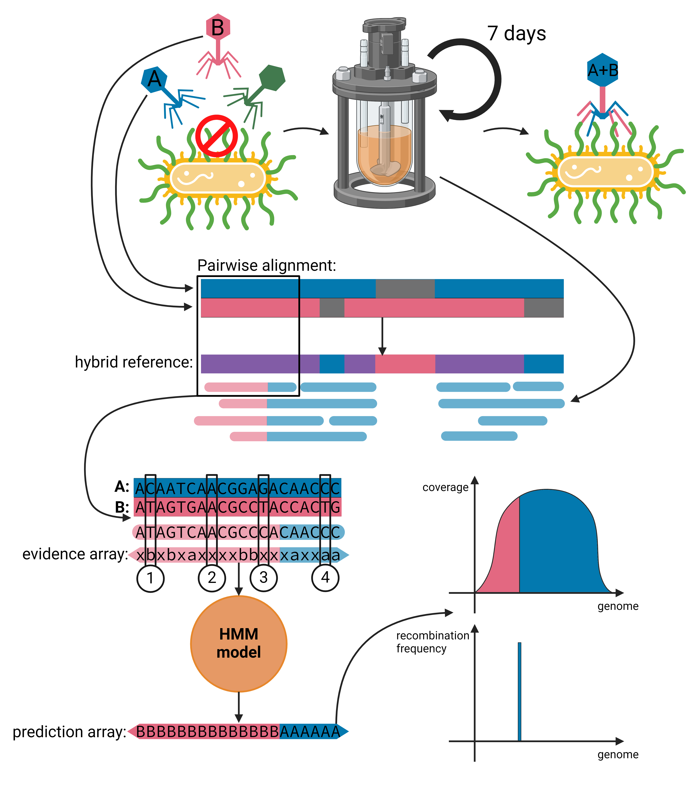

# Recombinant Population Analysis

This tool can analyse the data of directed evolution experiments of phages sequenced with Oxford Nanopore Technology. The original application of this tool is to analyze the data produced by an [Aionostat](https://edoc.unibas.ch/96360/) experiment, a machine that allows automatic experimental evolution of phages.

This tool originated as part of [Valentin Druelle's PhD project](https://edoc.unibas.ch/96360/) and it was part of my [Bachelor thesis](old/thesis/Thesis_Giacomo_Castagnetti.pdf). I graduated in Genomics at University of Bologna. This project started in summer 2023 during the Biozentrum research summer project, at [NeherLab](https://neherlab.org/). I graduated in July 2024, with a final score of 110/110 cum laude, along with a honourable mention.

The pipeline follows the following schematic workflow:

The two references corresponding to the ancestral phages are combined in a hybrid reference. This reference can be used to align the reads of the recombinant population with minimap2. The obtained alignment of each read is considered the MSA of the 2 references + the recombinant read. From the MSA the evidences of the read belonging to ancestral sequence 1 or 2 are extracted and feeded to the HMM model. To have more details on the HMM model see [here](documentation/hmm.md). The inference results are summarized in a [plot](/documentation/plots.md) that gives a complete representation of the phage population composition over the course of the experiment.

# Configuration

You can run the pipeline by properly setting up the [run_config.yml](/run_config.yml) file and by creating a folder with the input data.

## Input folder

The input folder should have the following structure:

<pre>
data/
    reads/
        [replicate_code]_[timestep_code].fastq.gz
        ...
    references.fasta
</pre>

Each fastq file should be named with two codes, one identifying the experimental replicate and one progressively numbering successive timestep (in case of a time series analysis).

The two reference genomes should be included in the same fasta file named "references.fasta".

## run_config.yml

The run_config file has 4 sections:

- run_config: describes the file configuration of the pipeline run. Write down the name of the two references and of the replicates and timesteps that have to be analyzed.

- alignments: set the length threshold below which the reads will be ignored and not aligned to the hybrid reference.

- HMM_parameters: define the HMM parameters. To have more details see [here](documentation/hmm.md)

- optimization_recombination_parameter: set the data, parameters and subsampling size to use for the optimization of the recombination hyperparameter by maximum likelihood.

- plots: set the coverage threshold below which the inferences carried out on the site will not be shown in the plots.

# Running the pipeline

## Local execution

<pre>
snakemake --profile local --configfile run_config.yml
</pre>

## HPC execution 

<pre>
snakemake --profile cluster --configfile run_config.yml
</pre>