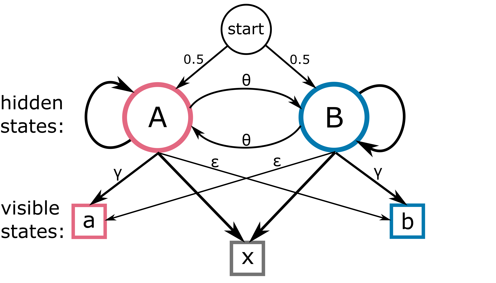

# Hidden Markov Model

## transition matrix

|   |A  |B  |
|---|---|---|
|A  |1-θ|0  |
|B  |0  |1-θ|

## emission matrix

|   |a  |b  |x  |
|---|---|---|---|
|A  |γ  |ϵ  |1-γ-ϵ|
|B  |ϵ  |γ  |1-γ-ϵ|

## description
At the core of the pipeline there is a Hidden Markov model (HMM) that can infer
whether a read or just part of is inherited from a reference sequence or the other.

To do this, the HMM takes in input the sequence of evidences of similarity of the
read with respect to the two references and returns the most likely path of the
read between the two sequences. The figure above shows a schematic representation of the
model. The HMM has two hidden states, corresponding to the two references (A and
B), and three visible states, corresponding to the evidences of similarity described
in the previous section (a is evidence for reference A, b is evidence for reference
B, and x is no evidence). The probability of jumping from one hidden state to the
next depends on a [transition matrix](#transition-matrix), where θ is the transition probability,
which is a hyperparameter (optimised below) related to the recombination frequency
of the dataset. The probability of emitting one of the three visible states depends on
the value of the hidden state. In the [emission matrix](#emission-matrix), γ is the probability
for a hidden state, to emit a correct evidence (A emits a or B emits b), while ϵ is
the (small) probability of emitting a misleading evidence corresponding to the other
hidden state (A emits b or B emits a). Since the two references are identical at
most sites, there will often be no discernible evidence (x). Lack of evidence will also
occur when ONT makes an error. The probability of having the correct evidence
(γ) represents the fraction of genome that is different between the two references
minus the error rate of the sequencing technology. The probability of emitting a
misleading evidence (ϵ) corresponds to the random sequencing errors that end up
suggesting the opposite base. The model starts with the same probability of being
in state A and B.

The model runs over the sequence of evidences using the Viterbi algorithm, a
dynamic programming approach that finds the optimal sequence of hidden states
starting from a sequence of emissions. Starting from the first element, the algorithm
fills a dynamic programming matrix with two rows (hidden states) and n columns
(length of the genome). For each cell, it computes the likelihood of reaching it from
the two previous hidden states, keeping only the optimal value. The likelihood is
computed by multiplying the probability computed up to the previous cell (0.5 at
the beginning) with the appropriate probability from the transition matrix (1-θ if
the hidden state is the same and θ if the hidden state switches) and the respective
emission probability. When every cell of the matrix is filled, backtracking can start.
From the final cell with highest likelihood, the sequence of optimal steps is recon-
structed going backward, taking each time the optimal step that was computed in
the initial phase.

The emission parameters of the exeriment were estimated using a dataset with-
out recombination, where the hidden state was known. The initial phages (bas51
and bas54) were sequenced alone, and the sequencing data was mapped to both
references to measure the frequency of the visible states. The conditional emission
probabilities for hidden state A were approximated based on the empirical frequency
of a,b, and x states observed in reads from the sequencing run of reference A. These
parameters amount to 0.972 for x, γ = 0.027 for the true evidence and ϵ = 0.001 for
the misleading evidence. The transition parameter θ was estimated on a subset of
the longest reads coming from the sequencing run of the recombinant population.
The model was tested with various values θ, and the final log-likelihood of each
read prediction was summed. A peak in the total likelihood was observed at ap-
proximately θ = 4*10−5. This parameter correlates with the recombination frequency
in the dataset, suggesting an expected recombination event roughly once every 25kbp.

The accuracy of the model was tested on artificially generated sequences. An accuracy of 0.9996 was
achieved in correctly assigning hidden states.

