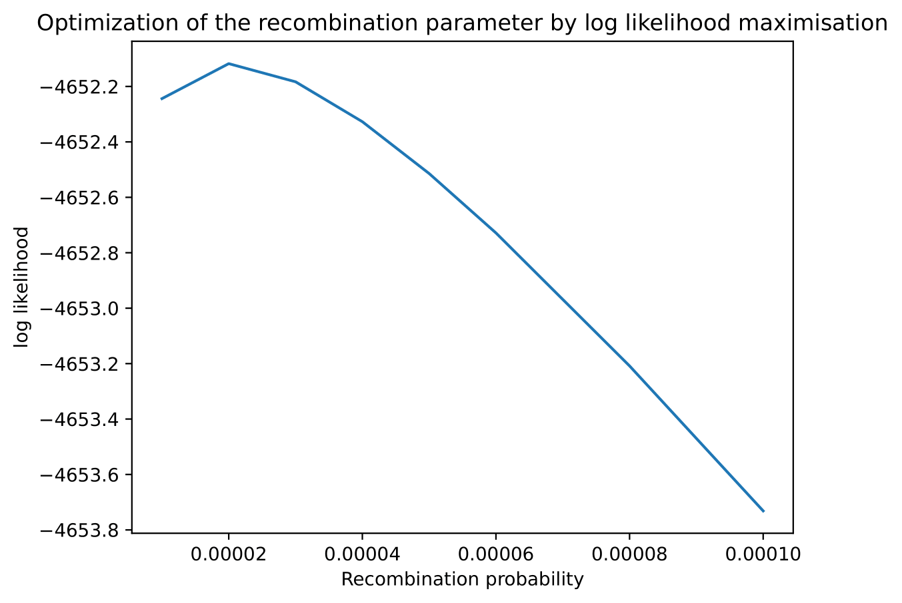

# Ouput

## Coverage plot

After gathering the inference carried out on all reads, for each site of the hybrid reference the fraction of reads assigned to ancestral sequence 1 and 2 is plotted.

Example:

## Recombination plot

After gathering the inference carried out on all reads, all the recombination events (i.e. position of a recombinant read where it is inferred the switch from a reference to the other) are plotted on the hybrid reference genome, normalised for the total amount of reads mapped on each position.

Example:

## Unique plot

## hyperparameter optimization

