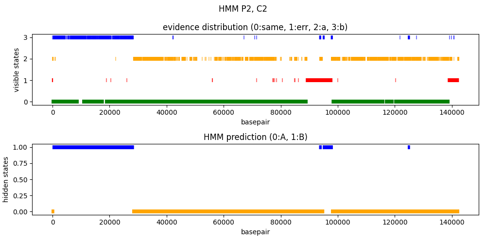
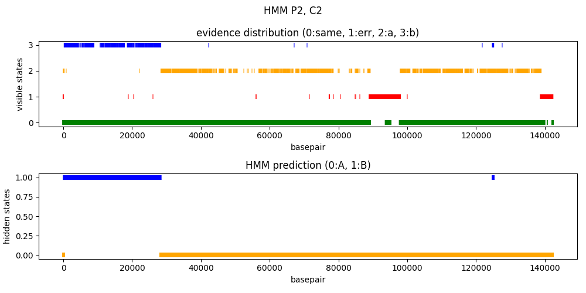

# HOW TO HANDLE GAPS IN HMM PREDICTION OF RECOMBINANT SEQUENCES?

## Skip any kind of gap

## Consider any kind of gap

## Skip gaps in references

## More in detail

- ref1,ref2,read
- x,x,-: no evidence (gap)
- -,-,-: no evidence
- -,-,x: no evidence (insertion)
- x,-,x: evidence 1
- -,x,x: evidence 2
- x,-,-: ?
- -,x,-: ?

maybe add a specific visible state in the model?