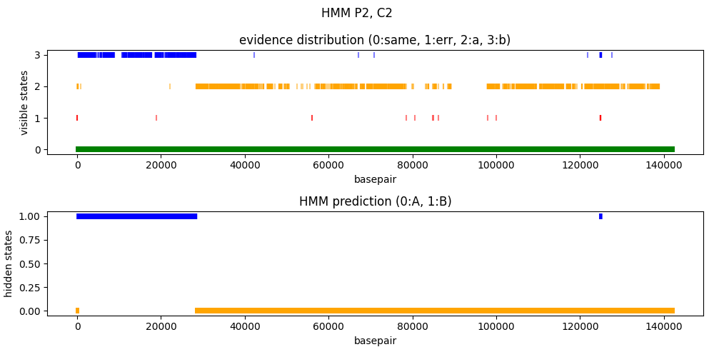

# Finding the recombinant reads

The problem we are facing and the strategy to solve it are well explained in [this pdf](plan.pdf).

For the following notes I will use the following notation:
- A: first phage genome
- B: second phage genome
- a: evidence on the read for the 

## Create a functioning HMM script

The first step is to create a working HMM that can get in input the type of data we are dealing with (an array of recombination evidences, a/./b), and that provides in output what we expect (the series of hidden states corresponing to the genome that provided the particular evidence, A/B).

I will try to use the following implementation of the viterbi algorithm: https://medium.com/@zhe.feng0018/coding-viterbi-algorithm-for-hmm-from-scratch-ca59c9203964

### generate data on the basis of given probabilities

To test that it is working i have to define some reasonable probability matrices. we need three matrices: initial probability matrix, transition probability matrix and emission probability matrix.

- initial probability matrix

|    |      |
|----|------|
|A   |0.5   |
|B   |0.5   |

- transition probability matrix

|    |A       |B       |
|----|--------|--------|
|A   |0.99    |0.01    |
|B   |0.01    |0.99    |

- emission probability matrix

|    |.        |a        |b        |
|----|---------|---------|---------|
|A   |0.59     |0.40     |0.01     |
|B   |0.59     |0.01     |0.40     |

Now i will generate sequences with these probabilities

- hidden states: "BBBBBBBBBBBBBBBBBBBBBBBBBBBBBBBBBBBAAAAAAAAAAAAAAAAAAAAAAAAAAAAAAAAAAAAAAAAAAAAAAAAAAAAAAAAAAAAAAAAAA"

- emissions:     "bb...b......bb.b.b.b...bb.bb....b.baa...a.a..aaabaaaa.aaa....aa.aa....a.aa..a......a.a.aaa.........aa"

both the results seem reasonable.

Of course in the case of the experiment the amount of a and b will be a lot less.

### make predictions on the generated data

i think that to use the viterbi script i have to convert every title of the matrices to integers (indexes)

- initial probability matrix

|    |      |
|----|------|
|0   |0.5   |
|1   |0.5   |

- transition probability matrix

|    |0       |1       |
|----|--------|--------|
|0   |0.99    |0.01    |
|1   |0.01    |0.99    |

- emission probability matrix

|    |0        |1        |2        |
|----|---------|---------|---------|
|0   |0.59     |0.40     |0.01     |
|1   |0.59     |0.01     |0.40     |

for this reason the previously produced sequence has to be translated to numbers

this is the array of emitted states:

[1, 1, 2, 2, 2, 1, 2, 2, 2, 2, 2, 2, 1, 1, 2, 1, 2, 1, 2, 1, 2, 2, 2, 1, 1, 2, 1, 1, 2, 2, 2, 2, 1, 2, 1, 0, 0, 2, 2, 2, 0, 2, 0, 2, 2, 0, 0, 0, 1, 0, 0, 0, 0, 2, 0, 0, 0, 2, 2, 2, 2, 0, 0, 2, 0, 0, 2, 2, 2, 2, 0, 2, 0, 0, 2, 2, 0, 2, 2, 2, 2, 2, 2, 0, 2, 0, 2, 0, 0, 0, 2, 2, 2, 2, 2, 2, 2, 2, 2, 0, 0]

this is the array of hidden states:

[1, 1, 1, 1, 1, 1, 1, 1, 1, 1, 1, 1, 1, 1, 1, 1, 1, 1, 1, 1, 1, 1, 1, 1, 1, 1, 1, 1, 1, 1, 1, 1, 1, 1, 1, 0, 0, 0, 0, 0, 0, 0, 0, 0, 0, 0, 0, 0, 0, 0, 0, 0, 0, 0, 0, 0, 0, 0, 0, 0, 0, 0, 0, 0, 0, 0, 0, 0, 0, 0, 0, 0, 0, 0, 0, 0, 0, 0, 0, 0, 0, 0, 0, 0, 0, 0, 0, 0, 0, 0, 0, 0, 0, 0, 0, 0, 0, 0, 0, 0, 0]

this is the predicted array of hidden states:

[1, 1, 1, 1, 1, 1, 1, 1, 1, 1, 1, 1, 1, 1, 1, 1, 1, 1, 1, 1, 1, 1, 1, 1, 1, 1, 1, 1, 1, 1, 1, 1, 1, 1, 1, 0, 0, 0, 0, 0, 0, 0, 0, 0, 0, 0, 0, 0, 0, 0, 0, 0, 0, 0, 0, 0, 0, 0, 0, 0, 0, 0, 0, 0, 0, 0, 0, 0, 0, 0, 0, 0, 0, 0, 0, 0, 0, 0, 0, 0, 0, 0, 0, 0, 0, 0, 0, 0, 0, 0, 0, 0, 0, 0, 0, 0, 0, 0, 0, 0, 0]

the prediction is 100% correct. I will run the script multiple times with random sequences

the accuracy is always around 99%. for now we are happy with this result.

## make predictions on Aionostat data

### phage isolates sequences

The recombination evidences are extracted from the msa of the two reference sequences and the assembly of the phage clone. This is done through the handle_msa.py script.

In hmm.py it is defined the Viterbi algorithm and the probability matrices. We take the recombination evidences of the clones and we give them in input to the Viterbi algorithm.

for the clones i used the following matrices:

- initial probability matrix

|    |      |
|----|------|
|0   |0.5   |
|1   |0.5   |

- transition probability matrix

|    |0       |1       |
|----|--------|--------|
|0   |0.999   |0.001   |
|1   |0.00    |0.999   |

- emission probability matrix

|    |0         |1        |2        |
|----|----------|---------|---------|
|0   |0.949     |0.05     |0.001    |
|1   |0.949     |0.001    |0.05     |

to obtain sensible results from i modified the viterbi algorithm to do additions between logarithms instead of multiplications between probabilities. this is because otherwise the probability would become too small.

this is the result:

### reads of phage population

the same procedure is applied to the reads of the population. in this case the array of evidences is much more noisy:

i tried to tweak a bit the parameters but the resutls have many problems:

these problems were just due to a bug in the code, the actual situation is much nicer!!!

at this point it would be nice to infer the correct parameters of the probability matrices.

#### parameters estimation

##### emission probabilities

to estimate the emission probabilities we can use reads of a sequencing run of a pure phage. by aligning these reads to the msa of references we can see with which frequency ., a and b evidences occur. we will just count the occurrence of each visible state.

The creation of the msa between the two references and a read takes more or less 30 seconds.

this will require a looooooot of time. i think we have to find another solution.

1. we could run the same script in parallel for multiple reads.

2. we could align multiple reads at the same time.