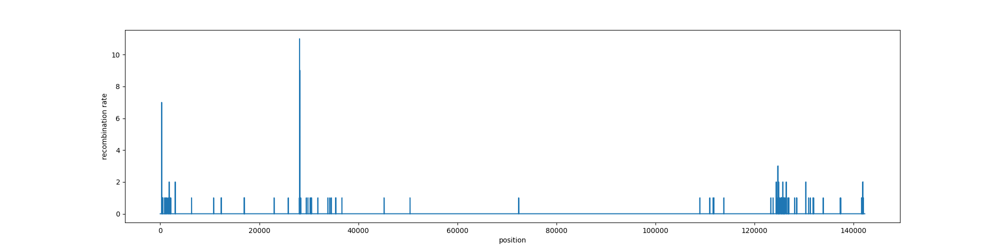
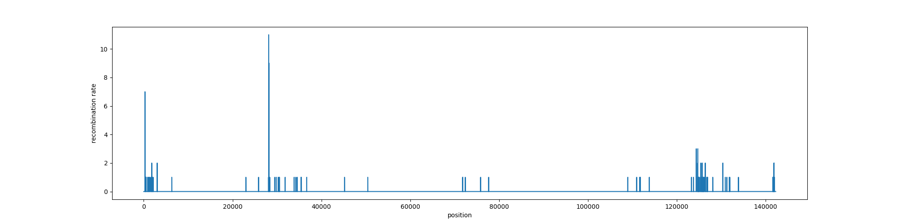
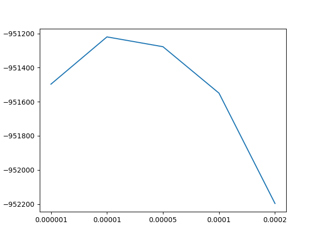

# SPEEDING UP THE PROCESS

Using MAFFT for each read is too slow. We need to use another approach.

# Hybrid reference approach

0. create a benchmark dataset
1. build a hybrid reference from the MSA
2. align the recombinant reads to the hybrid reference with minimap2
3. process the bam:
    remove the insertions of each read from the alignment (no gap in the reference)
    
    add the resulting sequence to the msa of the two references, in the mapping region indicated by minimap
    
    treat the new msa as the msa built by MAFFT
4. compare the results with the results obtained by MAFFT

## 0. create a test dataset (benchmark and run the MAFFT scripts on it)

1. filter the reads to obtain a subset of them that will be used as common testing dataset: test_EM11_new_chemistry.fastq.bgz, test_EM60_new_chemistry.fastq.bgz, test_P2_7.fastq.bgz

2. align these reads to the respective references and obtain .sam, .bam and .bai files:

<pre>

minimap2 -ax map-ont references/EM11_assembly.fasta test/test_EM11_new_chemistry.fastq.bgz > test/test_EM11_new_chemistry.sam
samtools sort -@ 4 -o test/test_EM11_new_chemistry.bam test/test_EM11_new_chemistry.sam
samtools index test/test_EM11_new_chemistry.bam test/test_EM11_new_chemistry.bam.bai

minimap2 -ax map-ont references/EM60_assembly.fasta test/test_EM60_new_chemistry.fastq.bgz > test/test_EM60_new_chemistry.sam
samtools sort -@ 4 -o test/test_EM60_new_chemistry.bam test/test_EM60_new_chemistry.sam
samtools index test/test_EM60_new_chemistry.bam test/test_EM60_new_chemistry.bam.bai

minimap2 -ax map-ont test/P2_references.fa test/test_P2_7.fastq.bgz > test/test_P2_7.sam
samtools sort -@ 4 -o test/test_P2_7.bam test/test_P2_7.sam
samtools index test/test_P2_7.bam test/test_P2_7.bam.bai

</pre>

parameters estimation with test dataset:

<pre>

mean null probability
EM11   0.967892723956481
EM60   0.9679468350646898

mean a probability
EM11   0.027694027601184522
EM60   0.0008853449723399029

mean b probability
EM11   0.0044132484423344415
EM60   0.031167819962970477

mean time spent
EM11   2.401213432613172
EM60   5.300837469427553

</pre>

recombination reads run on test datasett:

<pre>

mean time spent (per read and per base)
P2   4.327918840110849
P2   0.0002670344474164654
total reads 310
reads used 218
total time 945.3692042827606

</pre>

BIG BIG BIG BIG BIG PROBLEM: THIS TIME CONSIDERS ALSO THE TIME USED BY THE VITERBI ALGORITHM

## 1. build a hibyrid reference from the MSA

1. build the msa:

    <pre>

    mafft --auto results/msa/refs.fasta > results/msa/refs_msa.fasta

    </pre>

2. build the hybrid reference

    [script](../scripts/hybrid_reference.py)

## 2. align the recombinant reads to the hybrid reference with minimap2

<pre>

minimap2 -ax map-ont results/msa/hybrid_ref.fasta data/test/test_P2_7.fastq.bgz > data/test/hybrid_test_P2_7.sam
samtools sort -@ 4 -o data/test/hybrid_test_P2_7.bam data/test/hybrid_test_P2_7.sam
samtools index data/test/hybrid_test_P2_7.bam data/test/hybrid_test_P2_7.bam.bai

</pre>

## 3. process bam

1. get the alignment, its an array of tuples, each tuple has the index fo the read and the index of the reference. if there is a gap in either one, the value is None.

2. we build the sequence of the aligned read, putting "-" when the alignment is None on the read (gaps) and ignoring the read bases when the alignment is None on the reference (insertions)

3. we cut the msa of the two references in correspondence of the start and end of the mapping of the read and we add the sequence directly to the msa, pasting it under the references

4. we analyse the msa the same as for the other cases

the time required to analyse each read of the test set alignment is:

<pre>

mean time spent (per read and per base)
P2   1.6704628843444962
P2   7.103318282339456e-05
total reads 223
reads used 222
total time 443.5385274887085

</pre>

that's a good improvement, even though the performance is still not the best.

## 4. compare the results with the results obtained by mafft

We will compare the genome wide recombination:

<pre>

MAFFT:
mean time spent (per read and per base)
P2   4.327918840110849
P2   0.0002670344474164654
total reads 310
reads used 218
total time 945.3692042827606

</pre>

img:

<pre>

hybrid ref:
mean time spent (per read and per base)
P2   1.6704628843444962
P2   7.103318282339456e-05
total reads 223
reads used 222
total time 443.5385274887085

</pre>

img:

there are differences. the result from the hybrid reference approach seems to have better signal.

maybe this is due to the MAFFT command, i will try to use the automatic options:

<pre>

MAFFT:
mean time spent (per read and per base)
P2   8.35179340511287
P2   0.0004729846803596409
total reads 310
reads used 218
total time 1823.0863628387451

</pre>

img:

no improvements. maybe we cannot trust mafft (used in the way we are using it) as much as we trust minimap2.

the number of recombination events is the same in the two arrays: 178.

# Parameter estimation

## Emission parameters

We can implement the same hybrid reference approach and see how the results compare with respect to MAFFT.

<pre>

minimap2 -ax map-ont results/msa/hybrid_ref.fasta data/test/test_EM11_new_chemistry.fastq.bgz > data/test/hybrid_test_EM11_new_chemistry.sam
samtools sort -@ 4 -o data/test/hybrid_test_EM11_new_chemistry.bam data/test/hybrid_test_EM11_new_chemistry.sam
samtools index data/test/hybrid_test_EM11_new_chemistry.bam data/test/hybrid_test_EM11_new_chemistry.bam.bai

minimap2 -ax map-ont results/msa/hybrid_ref.fasta data/test/test_EM60_new_chemistry.fastq.bgz > data/test/hybrid_test_EM60_new_chemistry.sam
samtools sort -@ 4 -o data/test/hybrid_test_EM60_new_chemistry.bam data/test/hybrid_test_EM60_new_chemistry.sam
samtools index data/test/hybrid_test_EM60_new_chemistry.bam data/test/hybrid_test_EM60_new_chemistry.bam.bai

</pre>

<pre>

hybrid reference                    MAFFT
mean null probability
EM11   0.9662429815268376           0.967892723956481
EM60   0.9679095862036405           0.9679468350646898

mean a probability
EM11   0.026737786705818084         0.027694027601184522
EM60   0.0011348214186898934        0.0008853449723399029

mean b probability
EM11   0.007019231767344301         0.0044132484423344415
EM60   0.03095559237766953          0.031167819962970477

mean time spent
EM11   0.14966010513590344          2.401213432613172
EM60   0.20331921707205222          5.300837469427553

</pre>

# transition parameter

the transition parameter is estimated by running the prediction with different transition parameters, recording the resulting likelihood. The viterbi algorithm is already calculating the final log likelihood of the prediction, we will just have to give it in output together with the prediction array.

We compute the log likelihood for each read and we sum it with the total log likelihood for the dataset (computed for a specific parameter). By running the same model with different parameters on the same dataset we will have different total log likelihood for the total alignments.

We will estimate the transition parameter just by considering the test dataset.

We run the prediction on the same reads, that give the same evidence arrays, for the following values of transition probability:

[0.000001, 0.00001, 0.00005, 0.0001, 0.0002]

we run each iteration with the hybrid reference approach since it is faster.

these are the resulting log likelihoods:

[-951497.188732949, -951220.0044402143, -951277.587461576, -951549.7766143129, -952196.7981547866]

we can build a graph:

the best parameter to use is 0.00001

meaning that we assume a recombination event every 10 k bases