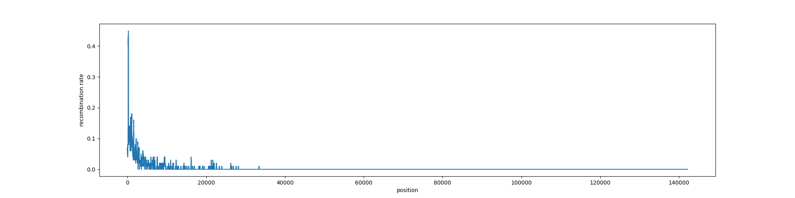
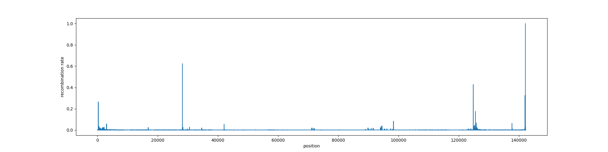

# improving the scripts

## splitting evidence array extraction and prediction

We want to go through the bam file, build the artificial msa thorugh the minimap2 alignment and extract the evidence array from it. the array will be saved as a line in a .tsv file, together with the start and end of the mapping of the read (useful to build the plot of total recombination).

A second script will iterate through the tsv file, giving in input to the viterbi algorithm the sequence of evidences and them analysing the prediction array. if the prediction has a switch (recombination) we want to add it to a genome wide array, in the correct place, adding to the index of the prediction the mapping start.

## parallelisation

Fortunately python allows to imlement parallelisation easily.

we process the bam and we extract the evidences for each ealignment, writing them on a .tsv file.

Then with another script we iterate in the .tsv, adding to a list the evidence array and to another one the index corresponding to the start of the alignment.

We use the Pool function to use all the cores at the same time, we give them the viterbi algorithm to execute together with the list of evidence arrays.

the ouput will be a list of arrays, we can iterate through them and summarise their information in a single recombination array.

# whole dataset

align all the reads on the hybrid reference.

<pre>

minimap2 -ax map-ont results/msa/hybrid_ref.fasta data/population_reads/P2_7.fastq.gz > results/alignments/P2_7.sam
samtools sort -@ 4 -o results/alignments/P2_7.bam results/alignments/P2_7.sam
samtools index results/alignments/P2_7.bam results/alignments/P2_7.bam.bai

minimap2 -ax map-ont results/msa/hybrid_ref.fasta data/pure_reads/EM11_new_chemistry.fastq.gz > data/test/hybrid_test_EM11_new_chemistry.sam
samtools sort -@ 4 -o dacta/test/hybrid_test_EM11_new_chemistry.bam data/test/hybrid_test_EM11_new_chemistry.sam
samtools index data/test/hybrid_test_EM11_new_chemistry.bam data/test/hybrid_test_EM11_new_chemistry.bam.bai

minimap2 -ax map-ont results/msa/hybrid_ref.fasta data/pure_reads/EM60_new_chemistry.fastq.gz > data/test/hybrid_test_EM60_new_chemistry.sam
samtools sort -@ 4 -o data/test/hybrid_test_EM60_new_chemistry.bam data/test/hybrid_test_EM60_new_chemistry.sam
samtools index data/test/hybrid_test_EM60_new_chemistry.bam data/test/hybrid_test_EM60_new_chemistry.bam.bai

</pre>

we run hmm_rec_reads.py on the whole dataset. i want to see if the result is cool. then we will decide if and how to speed up the process.

i will put a threshold of 5kb of read length. this means that we will analyse 30% of reads and 70% of the total information in terms of mapped bases.

this is the result:

<pre>

mean time spent (per read and per base)
P2   0.3613691231787451
P2   3.102784908542215e-05
total reads 250355
reads used 67274
total time 24346.091243982315

</pre>

img:

we can try to normalise for the coverage

## new run

evidence arrays:

<pre>
mean time spent per read 0.08137937484408586
total time 5519.966312408447
total reads 250355
reads used 67274
</pre>

