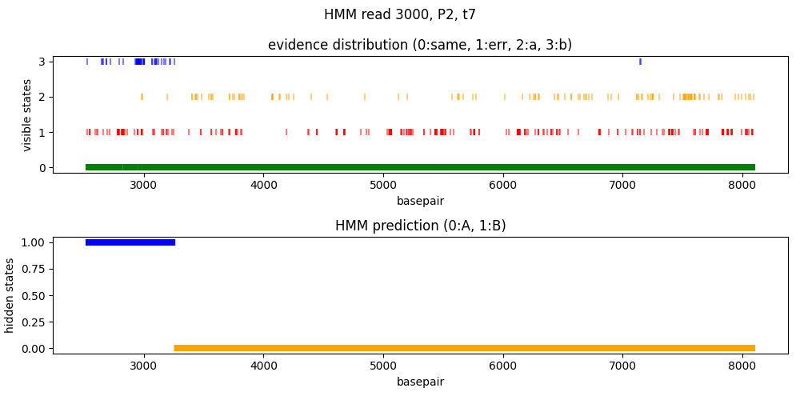

# HMM TO PREDICT RECOMBINATION

We want to use a hidden markov model to reconstruct the most likely path of a recombinant read between two different references.

The HMM model will have [this structure](plan.pdf)

## prediciton on sequences of phage isolates

- initial probability matrix (A=0, B=1)

|0     |1     |
|------|------|
|0.5   |0.5   |

- transition probability matrix (A=0, B=1)

|    |0       |1       |
|----|--------|--------|
|0   |0.999   |0.001   |
|1   |0.001   |0.999   |

- emission probability matrix (no evidence=0, evidence for A=1, evidence for B=2)

|    |0         |1        |2        |
|----|----------|---------|---------|
|0   |0.949     |0.05     |0.001    |
|1   |0.949     |0.001    |0.05     |

Gaps here are completely skipped.

We dicuss about gaps [here](gaps.md).

## prediciton on reads

We want to add a read to the msa of the two references. this unfortunately takes too much time.

A solution that we found is to cut the MSA of the two references in corresponding of the mapping region of the read indicated by the minimap2 alignment. This also helps to delimit the borders of the mapping and makes it easier to extract the evidences of recombination just in that region.

The script follows the following logic: we go through the reads mapped to both references, and for each read:

- we check that it is not a secondary or supplementary alignment
- we check to which reference it is aligned (we will consider the coordinates of one reference as good to cut in the right place the alignment. We discuss about this [here](../notebooks/refs_plots.ipynb))
- we extract the start and end of alignmeeent
- we cut the msa on the basis of the [index map](../scripts/handle_msa.py) between the phage reference of the read and the msa of both references
- we add the read to the msa. we give to mafft the whole read sequence (even if it maps less) and we ask mafft to do the msa by keeping the length of the two references. (DO WE HAVE TO CHANGE THIS?)
- we do the prediction on msa of the 3 sequences
- we plot the result

This is an example:

### time problem

100 k to 300 k reads per bam file. mean time spent for each read: 0.5 s (calculated on a relatively small sample).

We are using the most approximate algorithm of MAFFT. Are we making a lot of mistakes?

We are using --keeplength argument. Is it acting nicely? are we loosing a lot of sequence?

## parameter estimation

### estimating the emission probabilities in reads

We use the same method of recombinant reads prediction to estimate the emission probabilities. We analyse the reads coming from a sequencing run of a pure phage, aligned to the phage reference genome, in this way we understand how likely it is for ONT to give evidences for the opposite reference by chance.

Also in this case we use the mapping information on just one reference to cut the msa containing both references.

The results for a small sample of reads are the following:

<pre>

mean null probability
EM11   0.9825947907071777
EM60   0.9772102791664006

mean a probability
EM11   0.008471984172513073
EM60   0.0009509440754558615

mean b probability
EM11   0.008933225120309123
EM60   0.021838776758143563

mean time spent
EM11   0.5517718839645386
EM60   0.3548362874984741

</pre>

Also in this case time is half a second.

The emission frequencies are pretty different depending on the phage.

### estimating the emission probabilities in clones

???

### estimating the transition probabilities in reads

???

### estimating the transition probabilities in clones

???