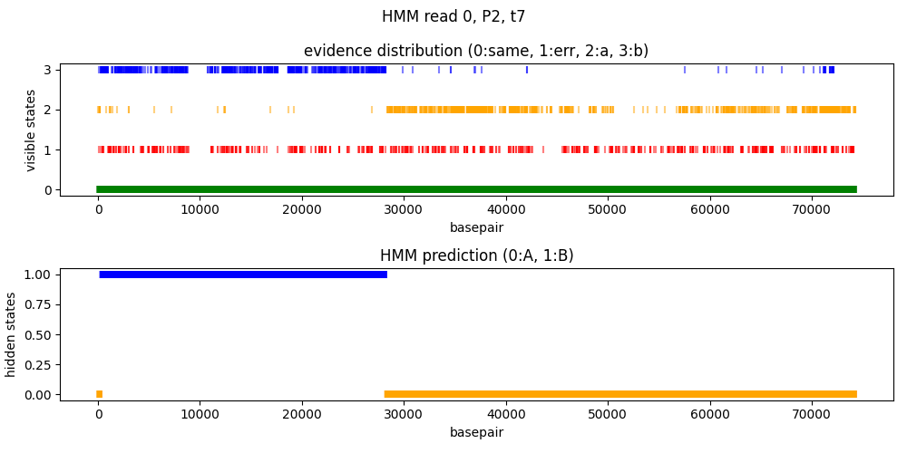
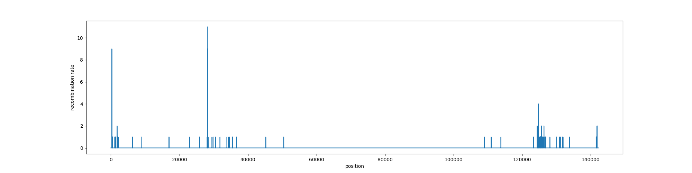

# FRAMEWORK TO USE HMM TO PREDICT RECOMBINATION

We want to use a hidden markov model to reconstruct the most likely path of a recombinant read between two different references.

The HMM model will have [this structure](plan.pdf)

## prediciton on sequences of phage isolates

- initial probability matrix (A=0, B=1)

|0     |1     |
|------|------|
|0.5   |0.5   |

- transition probability matrix (A=0, B=1)

|    |0       |1       |
|----|--------|--------|
|0   |0.999   |0.001   |
|1   |0.001   |0.999   |

- emission probability matrix (no evidence=0, evidence for A=1, evidence for B=2)

|    |0         |1        |2        |
|----|----------|---------|---------|
|0   |0.949     |0.05     |0.001    |
|1   |0.949     |0.001    |0.05     |

Gaps here are completely skipped.

We can do the same thing for a single read of a recombinant population:

## Trying to find an  efficient method (to do again)

We have a lot of reads to analyse. We will work for now on the sequencing run of population two at timestep seven. This dataset has:

- 249382 total informative alignments
- 1038216984 mapped bases

It's useful to talk about how many bases we have because they are not evenly distributed between the reads: 30% of reads contain roughly 70% of bases. Therefore, depending on the type of reads we are analysing the time required will be really variable.

We created a subset of the longest reads on which to test our approach. The [filter_reads_for_banchmark.py](../test/filter_reads_for_benchmark.py) script takes more or less 100 reads for each of the datasets we are using and creates subdatasets.

Since we are analysing very long reads the time per read will be really large and non representative of the time required on the whole dataset. We will use this measure just to compare different methods.

We are using two runs of pure phages for parameter estimation and a run of a population of recombinant phages for prediction of recombination

## Parameter estimation

### Emission probabilities

to estimate emission probabilities...

#### MAFFT

We want to add a read to the msa of the two references. We do this by cutting the MSA of the two references in correspondance of the mapping region of the read indicated by the minimap2 alignment. This also helps to delimit the borders of the mapping and makes it easier to extract the evidences of recombination just in that region.

The script follows the following logic: we go through the reads mapped to both references, and for each read:

- we check that it is not a secondary alignent
- we extract the start and end of alignmeeent
- we cut the msa on the basis of the [index map](../scripts/handle_msa.py) between the phage reference of the read and the msa of both references
- we add the read to the msa. we give to mafft the whole read sequence (even if it maps less) and we ask mafft to do the msa by keeping the length of the two references.
- we extract the evidences for one reference or the other from the msa

<pre>

mean null probability
EM11   0.967892723956481
EM60   0.9679468350646898

mean a probability
EM11   0.027694027601184522
EM60   0.0008853449723399029

mean b probability
EM11   0.0044132484423344415
EM60   0.031167819962970477

mean time spent per read
EM11   2.2086943002571737
EM60   4.808759524397654

</pre>

#### Hybrid reference method

To speed up things, we want to reconstruct the MSA only with the information that minimap2 gives us.

explain hybrid ref method.

<pre>

mean null probability
EM11   0.9662429815268376
EM60   0.9679095862036405

mean a probability
EM11   0.026737786705818084
EM60   0.0011348214186898934

mean b probability
EM11   0.007019231767344301
EM60   0.03095559237766953

mean time spent per read
EM11   0.09368139950197134
EM60   0.1416853414911802

</pre>

The paramenters are basically the same, we can use the hybrid reference method for the whole dataset. but first we lack another parameter.

### transition probabilities

how do we want to estimate this?

explain

since we have to run the script several time we will estimate this only with the hybrid reference method.

1 * 10^5 is the parameter that gives the highest likelihood, with a value of -942906.2638220732 on the test dataset.

# RUNNING THE PREDICTION

we will use the model with the following parameters:

- initial probability matrix (A=0, B=1)

|0     |1     |
|------|------|
|0.5   |0.5   |

- transition probability matrix (A=0, B=1)

|    |0         |1         |
|----|----------|----------|
|0   |0.99999   |0.00001   |
|1   |0.00001   |0.99999   |

- emission probability matrix (no evidence=0, evidence for A=1, evidence for B=2)

|    |0         |1        |2        |
|----|----------|---------|---------|
|0   |0.967     |0.03     |0.003    |
|1   |0.967     |0.003    |0.03     |

## Test dataset

### MAFFT

We want to add a read to the msa of the two references. We do this by cutting the MSA of the two references in correspondance of the mapping region of the read indicated by the minimap2 alignment. This also helps to delimit the borders of the mapping and makes it easier to extract the evidences of recombination just in that region.

The script follows the following logic: we go through the reads mapped to both references, and for each read:

- we check that it is not a secondary alignment
- we check to which reference it is aligned (we will consider the coordinates of one reference as good to cut in the right place the alignment. We discuss about this [here](../notebooks/refs_plots.ipynb))
- we extract the start and end of alignmeeent
- we cut the msa on the basis of the [index map](../scripts/handle_msa.py) between the phage reference of the read and the msa of both references
- we add the read to the msa. we give to mafft the whole read sequence (even if it maps less) and we ask mafft to do the msa by keeping the length of the two references. (DO WE HAVE TO CHANGE THIS?)
- we do the prediction on msa of the 3 sequences

If we run this for every read of the test dataset we end up with:
<pre>

mean time spent per read 5.646010920542095
total time 1232.6866056919098

</pre>

n of alignment in the test dataset: 310
n of informative alignments: 218
n of total useful bases: 6908411
estimated time per base: 0.000178

### hybrid reference

To speed up things, we want to reconstruct the MSA only with the information that minimap2 gives us.

explain the hybrid reference method

<pre>
mean time spent per read 1.6535292863845825
total time 367.27632236480713
</pre>

n of alignment in the test dataset: 223
n of useful alignments: 222
n of useful bases: 6892631
estimated time per base: 0.000053

## Total dataset

estimated total time: 1038216984 * 0.000053 = 12 h

other ways to speed up:

parallelisation

